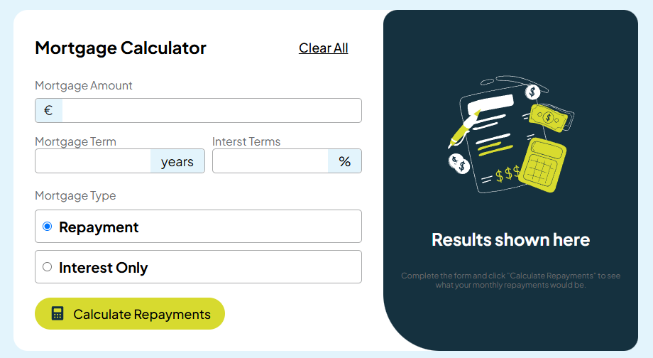

# 🏠 Mortgage Repayment Calculator

## 👋 Seja bem-vindo

Este projeto foi desenvolvido a partir de um desafio do site **Frontend Mentor**.  
É uma calculadora funcional de hipoteca (mortgage calculator), totalmente interativa e responsiva.

## 🛠️ Tecnologias utilizadas

- HTML
- CSS
- JavaScript

## 💡 O que aprendi/fiz de novo

- Manipulação de formulários com JavaScript
- Alteração dinâmica de estilos usando `.style`
- Atualização do conteúdo da página usando `.innerHTML`
